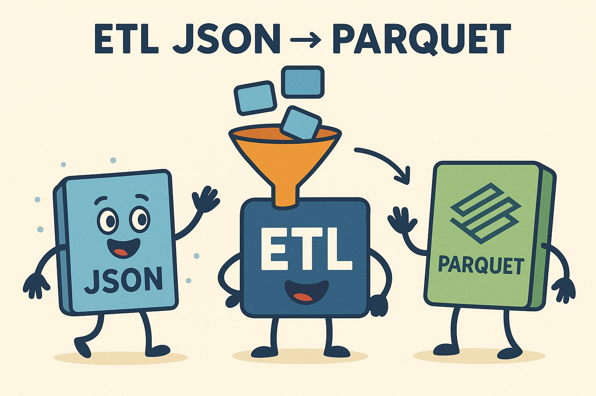

# ETL JSON → Parquet Pipeline

This project is a simple ETL pipeline that reads JSON sales data, calculates total sales, and saves the results as Parquet or CSV files.  

It is organized following a common Python project structure with separate folders for source code, utilities, and tests.

## Project Structure

````
etl-json/
├── src/
│ ├── pipeline.py
│ └── utils/
│   ├── init.py
│   └── etl.py
├── tests/
│ ├── init.py
│ └── test.py
├── data/
│ ├── sales_day01.json
│ ├── sales_day02.json
│ ├── sales_day03.json
│ ├── sales_day04.json
│ └── sales_day05.json
├── pyproject.toml
├── poetry.lock
├── README.md
├── .flake8
└── .pre-commit-config.yaml
````
## Requirements

- Python 3.10+
- [Poetry](https://python-poetry.org/) for dependency management
- Pandas

Install dependencies:

```bash
poetry install
```

## How to Run

### From the project root:

```
python -m src.pipeline
```
### This will:

1. Read all JSON files in ``data/``

2. Calculate total sales per item

3. Save the resulting DataFrame as Parquet or CSV in the same folder

### Run tests

````
python -m unittest discover -s tests
````

## Project Highlights

- Organized using ``src/`` for source code and ``tests/`` for test cases
- ETL functions are reusable and modular (``utils/etl.py``)
- Paths are handled with ``pathlib`` for cross-platform compatibility
- Simple pipeline suitable for extension with more data sources or transformations
